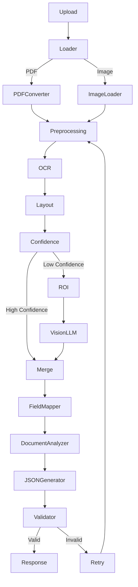

# Form Extractor API

## Architecture (3 independent services)

```
POST /extract
  |
  v
[API Service]  routers/extract.py
  - upload handling, orchestration, error handling, logging
  |
  v
[OCR Service]  services/ocr_service.py
  - save_upload()
  - pdf_to_images() / load_image_any()
  - preprocess()        (gray -> denoise -> adaptive threshold -> deskew)
  - run_ocr_on_image()  (PaddleOCR)
  - build_ocr_result()  -> normalized OCRToken list (text, bbox, confidence, line_id)
  |
  v
[Extraction Service]  services/extraction_service.py
  - build_ocr_context()  -> line-grouped text layout for the LLM
  - call_llm()           -> Claude, strict JSON-only system prompt
  - extract_fields()     -> validates JSON shape, retries on failure, returns ExtractionResult
  |
  v
FastAPI JSON Response
```

**Why the split matters:** swapping PaddleOCR for another engine (Surya, Tesseract,
a cloud OCR API) only touches `ocr_service.py`. Swapping the LLM/provider only
touches `extraction_service.py`. The router never changes.

## Project layout

```
app/
  main.py                     FastAPI app entrypoint
  routers/
    extract.py                POST /extract orchestration
  services/
    ocr_service.py             OCR Service
    extraction_service.py      Extraction Service (LLM)
  models/
    schemas.py                 Pydantic models (OCRToken, ExtractedField, etc.)
  utils/
    geometry.py                 line-grouping / bbox helpers used by OCR service
    regex.py                    optional field-type regex, if you add rule-based validation later
  core/
    config.py                   env-driven settings
    logging_config.py           logging setup
```

## Setup

```bash
python -m venv venv
source venv/bin/activate
pip install -r requirements.txt

# system dependency for pdf2image
# Linux / WSL:
# sudo apt-get install poppler-utils
# Windows:
# install Poppler and add its Library\bin folder to PATH
# For example, with Chocolatey:
# choco install poppler -y

cp .env.example .env
# edit .env and set ANTHROPIC_API_KEY

uvicorn app.main:app --reload --port 8000
```

## Usage

```bash
curl -X POST http://localhost:8000/extract \
  -F "file=@/path/to/form.pdf"
```

Response shape:

```json
{
  "success": true,
  "data": {
    "filename": "form.pdf",
    "page_count": 1,
    "fields": [
      {"label": "name", "value": "Rahul Sharma", "confidence": 0.94, "field_type": "text"},
      {"label": "date_of_birth", "value": "1998-04-12", "confidence": 0.91, "field_type": "text"},
      {"label": "terms_accepted", "value": true, "confidence": 0.88, "field_type": "checkbox"}
    ],
    "raw_token_count": 42,
    "llm_attempts": 1,
    "warnings": []
  },
  "error": null
}
```

## Notes / next steps

- `LLM_MAX_RETRIES` controls how many times the Extraction Service retries if
  the model returns invalid/malformed JSON.
- Table fields come back as `{"headers": [...], "rows": [[...], ...]}` inside `value`.
- If you want a rule-based fallback (no LLM available), `utils/regex.py` already
  has label keywords + validators ready to wire into a fallback path in
  `extraction_service.py`.
